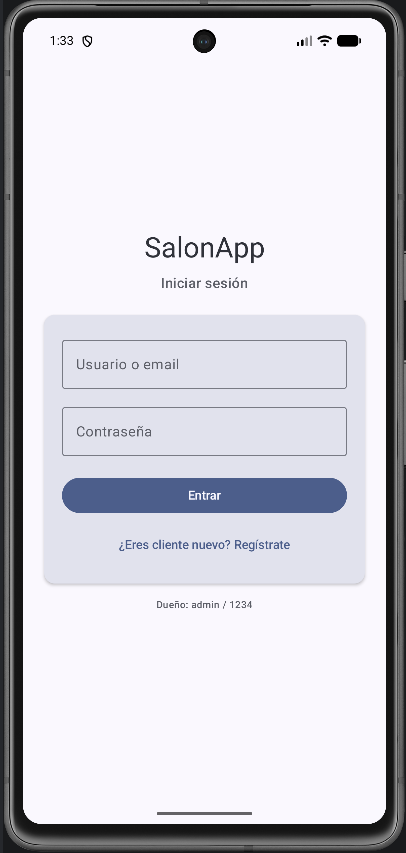
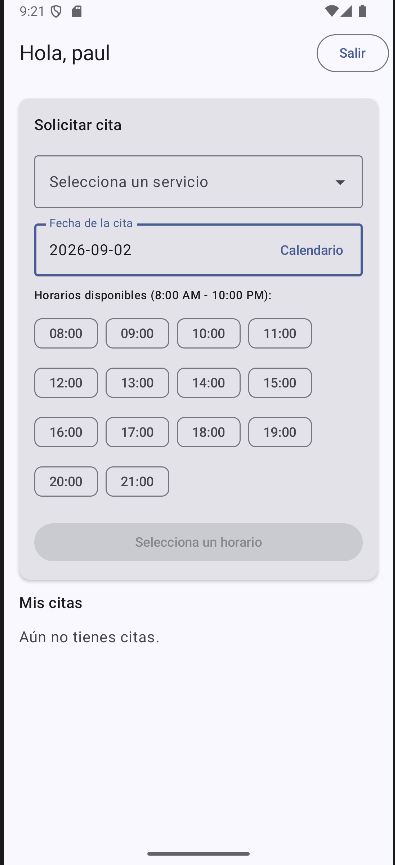
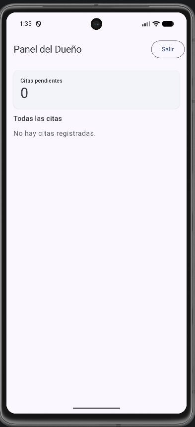

# 💇‍♀️ SalonApp — Gestión de citas para salones de belleza


Aplicación nativa de Android (Kotlin + Jetpack Compose + Material 3) para la gestión
de citas de un salón de belleza con dos roles: **Cliente** y **Dueño**.
Con recordatorios mediante AlarmManager.

## ✨ Características

- 🔐 **Autenticación segura**: Login y registro con Firebase Auth (email/password).
- 🔒 **Seguridad de datos**: Contraseñas hasheadas con PBKDF2-HMAC-SHA256 (600k iteraciones, salt aleatorio) antes de cualquier procesamiento local.
- ☁️ **Base de datos en la nube**: Firestore para sincronización de citas en tiempo real entre cliente y dueño.
- 📅 **Panel Cliente**: Solicitud de citas con validación en vivo de disponibilidad de horarios.
- 📊 **Panel Dueño**: Dashboard reactivo con contador de pendientes y acciones de aprobar/rechazar/completar.
- 🔔 **Notificaciones Push**: Integración con Firebase Cloud Messaging (FCM) para recordatorios y actualizaciones de estado en tiempo real.
- 
## 📸 Capturas de pantalla

| Login | Panel Cliente | Panel Dueño |
|---|---|---|
|  |  |  |

## 🛠️ Stack tecnológico

| Área | Tecnología |
|---|---|
| Lenguaje | Kotlin 2.1.20 |
| UI | Jetpack Compose + Material 3 |
| Arquitectura | MVVM + Clean Architecture (3 capas) |
| Navegación | Navigation Compose (rutas type-safe `@Serializable`) |
| Base de datos | **Firestore** (fuente de verdad) |
| Autenticación | **Firebase Auth** |
| Notificaciones | **Firebase Cloud Messaging (FCM)** |
| Inyección | Hilt (KSP) |
| Seguridad | PBKDF2-HMAC-SHA256 (OWASP 2024) |
| Async | Coroutines + StateFlow + callbackFlow |

## 🔐 Seguridad y decisiones de diseño (ADR)

- **ADR-01 — Migración a Arquitectura Cloud**: Se evolucionó de un MVP 100% local a una arquitectura cloud. Firestore actúa como fuente de verdad para la sincronización multi-dispositivo.
- **ADR-02 — Seguridad de Credenciales**: Aunque Firebase Auth gestiona la autenticación, se implementó hashing local con PBKDF2-HMAC-SHA256 (600,000 iteraciones, salt aleatorio por usuario y comparación en tiempo constante) como capa adicional de defensa en profundidad y cumplimiento de estándares académicos de seguridad.
- **ADR-03 — Notificaciones**: Se reemplazó/complementó `AlarmManager` con FCM para permitir notificaciones push escalables desde la nube, superando las limitaciones de Doze Mode de Android.
- **Reglas de Firestore**: Configuradas para permitir lectura/escritura solo a usuarios autenticados, con validación de propiedad de documentos.

## 🏗️ Arquitectura

Separación en capas con **inversión de dependencia**: `domain` define contratos,
`data` los implementa y `ui` consume use cases. Hilt realiza el wiring.

```mermaid
flowchart TB
    subgraph UI["📱 Presentación (ui)"]
        SC["Screens Compose<br/>(Login, Client, Owner)"]
        VM["ViewModels<br/>(StateFlow)"]
        NAV["Navigation<br/>(Type-safe routes)"]
    end
    
    subgraph DOMAIN["🎯 Dominio (domain)"]
        UC["Use Cases<br/>(Login, CreateAppointment,<br/>ObserveAll, UpdateStatus)"]
        IR["Repository Interfaces<br/>(AuthRepository,<br/>AppointmentRepository)"]
    end
    
    subgraph DATA["💾 Datos (data)"]
        RR["Repository Implementations<br/>(FirebaseAuthRepository,<br/>FirestoreAppointmentRepository)"]
        FB["Firebase<br/>(Auth, Firestore, FCM)"]
        UTIL["Utilidades<br/>(AlarmScheduler,<br/>PasswordHasher)"]
    end
    
    SC --> VM
    VM --> UC
    UC --> IR
    RR -. implementa .-> IR
    RR --> FB
    RR --> UTIL
    
    style UI fill:#4285F4,color:#fff
    style DOMAIN fill:#FBBC04,color:#000
    style DATA fill:#34A853,color:#fff
